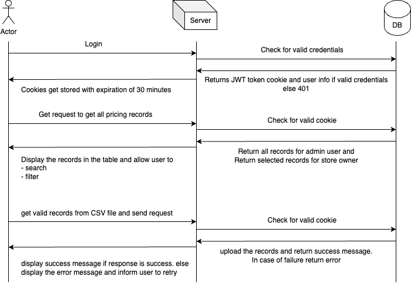

# Product pricing

## Running the project

- Run mongodb docker image

`docker run --name mongodb -d -p 27017:27017 mongo`

- add .env file with content:

```
PORT=3004
MONGO_URI=mongodb://localhost:27017/productPricingDB
JWT_SECRET=product_pricing_app
```

- run the backend server

```
cd backend
npm run dev
```

- run the frontend project

```
cd client
npm start
```

portal should be accessible from http://localhost:3000/ if no other project is already running on port 3000

### Note

- by default 1 admin user with username as admin and password as admin will be created. Use this to login to client portal.

## Requirements

### Functional

- Upload, persist, search, edit, and save pricing records

### Non Functional

- Scalability, performance, security, usability, maintainability, and internationalization

## Sequence Diagram



## Solution Architecture

### Frontend

#### Technologies:

- SPA with React
- Context Api for global store
- Typescript for type safety
- react-router-dom for routing
- i18n for internationalization
- styled components for theming and UI components
- prettier and eslint for formatting and clean code.

#### Features:

- user login and logout
- session check on refresh for valid user session
- Admin user role can upload csv related to any store and save pricing records
- Admin can search and edit any pricing record
- Store owner user role can upload csv related to their store and save pricing records
- Store owner can search and edit their pricing record

### Backend

#### Technologies:

- Express for server
- Mongodb for database
- JWT (JSON Web Tokens) for user authentication and session management
- bcryptjs to hash user passwords
- mongoose to interact with mongodb and perform CRUD operation
- cors for adding cors in local dev server

#### Features:

- user login and logout
- jwt and jwt token validity on each request
- create user in mongodb
- create and retrieve pricing records in mongoDB

## Design Decisions

- React for frontend for scalable and maintainable SPA.
- Node JS in the backend for non-blocking I/O.
- MongoDB for its flexibility and scalability

## Non-functional requirements considered and how the design addresses them

- 2 user types : Admin and Store owners. Admin can upload pricing record csv for any store as well as edit the records where as Store owners can only upload and edit records for their owned stores.
- Admin user can create more admin and store owner users
- JWT token cookie is sent each request and validated in the backend for robust security before performing any task.
- JWT token cookie also helps with user experience on browser refresh.
- Using Atomic design pattern for frontend code to improve maintainability and scalability. Add multiple re-usable components and implemented clean coding.
- Created theme using styled-components to quickly change the theme from central space.

## Assumptions

- Atleast 2 types of users to manage the data.

## Source for the implementation

- Styled-components documentation for theming
- JWT and bcrypt documentation for authentication
- Mongoose documentation for creating the schema
- ChatGpt for brainstorming
